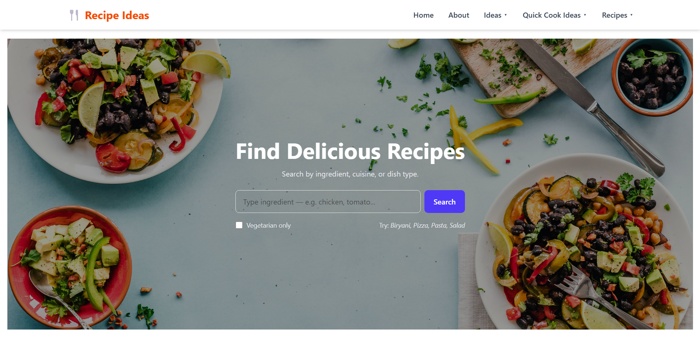

<<<<<<< HEAD

# 🍳 Recipe Ideas — React App

  

**Recipe Ideas** is a responsive recipe discovery app built for busy professionals like **Taylor**, who want quick meal inspiration based on the ingredients they already have or their dietary preferences.

  

It uses **TheMealDB API** to fetch recipes, ingredients, and meal details — helping users cook smarter and faster.

  

---

  

## 🚀 Features

  

- 🔍 **Search by ingredient** — find recipes based on what’s in your kitchen.

- 🥗 **Vegetarian filter** — toggle to show only vegetarian dishes.

- 📱 **Fully responsive UI** — optimized for desktop (3 columns), tablet (2 columns), and mobile (1 column).

- 🍔 **Recipe details modal** — view ingredients and instructions for each recipe.

- 🌍 **Category selector** — browse meals by country or cuisine.

- ⚡ **Fast and smooth UX** — with loading spinners and error handling.

- 🧠 **Built with React hooks** — `useState`, `useEffect`, and `useCallback` for clean logic and performance.

  

---

  

## 🧩 Tech Stack

  

-  **Frontend:** React + Vite

-  **Styling:** Tailwind CSS

-  **API:** [TheMealDB API](https://www.themealdb.com/api.php)

-  **Icons & UI Enhancements:** Lucide React, ShadCN components

  

---

  

## 📡 API Used

  

This project uses the free **TheMealDB API** for all meal and recipe data.

  

Example endpoints:

  

- Search by ingredient

https://www.themealdb.com/api/json/v1/1/filter.php?i=chicken

  
  

- Get vegetarian recipes

https://www.themealdb.com/api/json/v1/1/filter.php?c=Vegetarian

  
  

- Lookup full recipe by ID

https://www.themealdb.com/api/json/v1/1/lookup.php?i=52772

  
  

---

  

## 🖥️ How to Run Locally

  

### 1️⃣ Clone the Repository

git  clone  https://github.com/codebyfazil/recipe-ideas.git

  
  

2️⃣  Navigate  into  the  Project  Folder

cd  recipe-ideas

  

3️⃣  Install  Dependencies

npm  install

  

4️⃣  Start  the  Development  Server

npm  run  d

  

5️⃣  Open  in  Browser

  

Visit  http://localhost:5173

📱  Responsive  Layout

Device  Layout

🖥️  Desktop  3  recipe  cards  per  row (max width  1200px)

💻  Tablet  2  recipe  cards  per  row

📱  Mobile  1  recipe  card  per  row

✨  Screenshots

Home  Page  

![App Preview]

  
  

👨‍💻  Author

Mohamed  Fazil

Frontend  Developer | React  Enthusiast
**Connect with me:**
- 💼 [LinkedIn](https://www.linkedin.com/in/mohamed-fazil-a925a6339/)
- 🔗 [GitHub](https://github.com/codebyfazil)
- 🌐 [Portfolio](https://your-portfolio-link.com)

  

🧾  License

This  project  is  open  source  and  available  under  the  MIT  License.

  
  

🥘  Built  for  Taylor  —  because  every  busy  professional  deserves  a  little  help  in  the  kitchen.

  
  

---

  

Would  you  like  me  to  include  a  **project  screenshot  preview  section** (auto-generates markdown  for  your  actual  app  screenshots  once  you  upload  them)?

That’ll  make  your  GitHub  README  look  even  more  professional.
=======
# Recipe-ideas
>>>>>>> 4cd60408fc350ad8827a186c1d0c286b66a0373a
